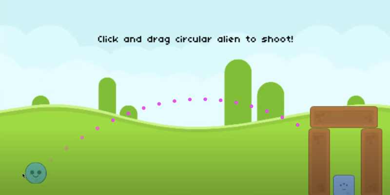

# Angry Birds

A physics-based projectile game inspired by Angry Birds, built with LÖVE2D for CS50's Game Development course.



## Description

This project recreates the core mechanics of Angry Birds using Lua and LÖVE2D. Players launch aliens from a slingshot toward structures built with destructible elements like glass, wood, and stone. It introduces realistic physics using impulse-based interactions and object destruction.

Features include:

- Physics-based projectile motion using custom launch mechanics
- Multiple material types with different physical properties (wood, glass, stone)
- Dynamic structures that collapse on impact
- Alien types with different effects
- Destructible environments and satisfying SFX

## How to Play

### Controls

- `Click + Drag`: Pull back on the launch marker  
- `Release`: Launch alien  
- `R`: Restart level  

### Objective

Knock down all obstacles and defeat the enemies using as few aliens as possible. Think about angle, force, and materials for max destruction!

## Development

### Built With

- [LÖVE2D](https://love2d.org/) — 2D game framework  
- Lua — Programming language  
- Custom physics and collision system  
- Object-oriented design with state-based game flow

### Project Structure

- `main.lua` — Game loop and entry  
- `src/` — Game logic, states, and objects (Aliens, Obstacles, etc.)  
- `lib/` — Helper libraries (class, hump, knife, rotLove, pathfinding, etc.)  
- `graphics/` — Sprites and environmental assets  
- `sounds/` — SFX and background music  
- `fonts/` — Game fonts

## Installation and Running

1. [Download and install LÖVE2D](https://love2d.org/)
2. Clone the repository:
   ```bash
   git clone https://github.com/ethanperello/angry-birds.git
   ```
3. Run the game:
   ```bash
   love angry-birds
   ```

## Demo

[Watch the gameplay demo](https://www.youtube.com/watch?v=O5gGkmil-Qg)

## Credits

- Developed by Ethan Perello  
- Created as part of CS50's Game Development course  
- Art and sound assets inspired by Angry Birds and sourced from Kenney.nl
